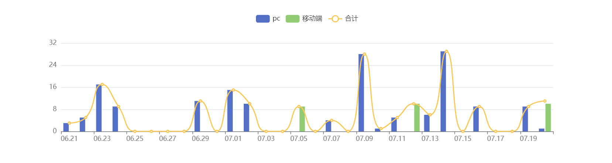

---
weight: 
title: "ACDEX 阿格斯"
description: "阿格斯交易所技术发展背景源自瑞士楚格，同时设立香港亚太总部，台湾、印尼办事处"
date: 2022-07-20T21:57:40+08:00
lastmod: 2022-07-20T16:45:40+08:00
draft: false
authors: ["kiki"]
featuredImage: "agesi.webp"
link: "https://1234btc.com/qk/agesi.html"
tags: ["交易所","ACDEX 阿格斯"]
categories: ["navigation"]
navigation: ["交易所"]
lightgallery: true
toc: true
pinned: false
recommend: false
recommend1: false
---
**简介**

ACDEX（全称Algo Cipher Decentralized Exchange，中文名：阿格斯国际站）注册落地于中国香港。

ACDEX（阿格斯国际站）是去中心化利润共享数字资产国际站，为客户提供多币种、多语言的币币交易和基金投资等产品服务，国际站已经成为一个去中心化、权益分红、执行高效、公开透明的数字资产国际站。用户可以在ACDEX上进行资产交易的同时，无须担心受制于平台的机制、数据安全和隐私保护，同时可以更进一步参与基金投资与平台分红。

ALGO CIPHER DECENTRALIZED EXCHANGE(ACDEX)阿格斯交易所技术发展背景源自瑞士楚格，同时设立香港亚太总部，台湾、印尼办事处。作为全球首家去中心化社区共治数字资产交易平台，平台运用自身庞大的大数据网络和高频量化技术的优势在数字资产领域实现全球各市场自动搬砖。取得了稳定客观的回报,同时设立了阿格斯基金，管理相当规模的数字资产。

阿格斯致力于全球SRO (自律组织)建设，目前已加入新加坡金融科技协会(SFA)并成为会员单位。阿格斯亦是香港区块链自律协会成员;更是参与了台湾区块链数字交易所自律委员会法案修订草案业成为其会员。

---

##### **数据统计**

##### 数据评估

ACDEX 阿格斯浏览人数已经达到3,902，如你需要查询该站的相关权重信息，可以点击"[爱站数据](https://1234btc.com/go/?url=aHR0cHM6Ly93d3cuYWl6aGFuLmNvbS9zZW8vYWNkZXguaW8%3D)""[Chinaz数据](https://1234btc.com/go/?url=aHR0cHM6Ly9zZW8uY2hpbmF6LmNvbS8%2FcT1hY2RleC5pbw%3D%3D)"进入；以目前的网站数据参考，建议大家请以爱站数据为准，更多网站价值评估因素如：ACDEX 阿格斯的访问速度、搜索引擎收录以及索引量、用户体验等；当然要评估一个站的价值，最主要还是需要根据您自身的需求以及需要，一些确切的数据则需要找ACDEX 阿格斯的站长进行洽谈提供。如该站的IP、PV、跳出率等！

> <u>特别声明</u>
>
> 本站1234BTC提供的ACDEX 阿格斯都来源于网络，不保证外部链接的准确性和完整性，同时，对于该外部链接的指向，不由1234BTC实际控制，在2020年3月28日 上午1:34收录时，该网页上的内容，都属于合规合法，后期网页的内容如出现违规，可以直接联系网站管理员进行删除，1234BTC不承担任何责任。