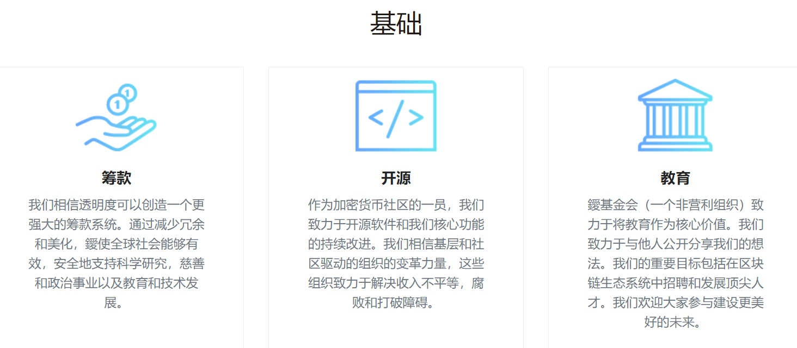

**一、项目简介**

Einsteinium使命是为了促进慈善，锿币直接关系到Einsteinium基金，这是一个基于比特币基础的针对慈善方面的项目，用以资助科研和尖端IT科技、加密数字货币项目，让社区成员投票决定资助哪些科研项目，并获得相应的奖励。emc2是该项目发行的代币,可能会改变全宇宙的数字货币。

**二、项目背景**

爱因斯坦基金会是官方的非营利组织，也是世界上第一个由加密货币支持的非营利组织。爱因斯坦基金会的主要特征是：

*1）持续致力于全球研究和慈善使命；*
*2）维护，维护和发展爱因斯坦（Einsteinium），这是一种基于安全，分散式开放式总账或区块链的国际数字货币。*
Einsteinium基金会的使命是利用区块链技术为科学研究筹集资金。实现这一目标有两种方法。第一种办法是征收采矿税，由此产生一批资金，向有资格申请的人提供赠款。第二个问题是维持一种货币，允许以一种更加透明和可信的方式来支持各种事业。Einsteinium硬币旨在减少浪费，并在最需要的地方根除腐败：慈善和政治。

**三、EMC2代币**

Einsteinium（EMC2）是一种开源的，类似于比特币的数字货币，使用了工作量证明加密算法。尽管此货币可用于任何类型的交易，但其主要用途是用于科学，慈善和政治筹款。该成因区块于2014年3月1日被开采。可开采的EMC2总数为245,465,283。in的开采分为多个时期：每个时期都开采36000枚硬币，目标持续约25天。

到2064年，所有硬币都将流通。在这一成熟点之后，预计将出现分叉，从而建立新的（仍待确定）治理系统，从而使自然通货膨胀率达到2％， EMC2理想用作稳定的全球货币。作为设计的一部分，征收了2.5％的采矿税。开采硬币后，2.5％会自动捐赠给基金会基金。（2％用于科学项目，0.5％用于水龙头，捐赠和市场营销费用。该基金帐户是完全透明的，每笔交易都记录在公共区块链上，以确保正确分配资金。相关链接:
https://www.emc2.foundation/more-about-foundation

---

# ABOUT

## **背景**  

**基金会**

鑀基金会是一个非营利组织（NPO），也是世界上第一个由加密货币支持的非营利组织。鑀基金会的定义特征是1）其对全球研究和慈善使命的持续承诺，以及2）保护，维护和开发鑀，鑀是一种建立在安全，分散的开放分类账或区块链上的国际数字货币。

科学研究是对我们的未来和我们星球未来的长期投资。近年来，世界各地用于“大创意”的资金急剧下降。作为对此的直接回应，基金会向有价值的申请人发放赠款。对哪些项目符合条件没有限制，但它们必须是科学的，努力进一步推动我们的知识和理解，并努力为我们建设一个更好，更安全，更稳定的未来。

我们的目标是与全球其他非营利组织和科学组织建立长期持久的关系，以支持未来各种突破性的科学项目。

**货币**

Einsteinium（EMC2）是一种开源的类似比特币的数字货币，它使用工作量证明scrypt算法。虽然这种货币可用于任何类型的交易，但其主要用途是用于科学，慈善和政治筹款。

创世区块于2014年3月1日开采。可开采的 EMC2 总数为 245，465，283。鑀的开采分为几个纪元：每个纪元开采36000块硬币，目标是持续约25天。所有硬币将在2064年之前流通。在此成熟点之后，预计会发生分叉，从而导致新的（尚未确定的）治理体系到位，从而产生 2% 的自然通货膨胀率，从而使 EMC2 非常适合用作稳定的全球货币。

作为设计的一部分，创建了2.5%的采矿税。当硬币被开采时，2.5%会自动捐赠给基金会基金。（2%用于科学项目，0.5%用于水龙头，捐赠和营销成本。该基金账户是完全透明的，每笔交易都记录在公共区块链上，以确保资金的正确分配。

**交换媒介**

鑀在主要国际交易所公开交易，将来将可用于购买世界各地的商品和服务。虽然它目前不是一种普遍接受的支付方式，但闪电网络等新功能将使 EMC2 能够在全球范围内进行交易。

**价值储存**

由于其设计的性质，鑀的会计分类账是不可变的。此外，它应是50年的通货紧缩货币，留出足够的时间达到临界质量。这种货币提供的透明度和安全性确保随着时间的推移，它将保持其交易价值，前提是系统具有良好的维护和适应性，以确保最先进的证券化。

**记账单位**

由于其价格波动的性质，所有加密货币目前都不是理想的记账单位。但是，EMC2 即将推出的一项功能将使其能够执行原子交换，或立即转换为其他形式，如比特币，甚至是由法定货币支持的硬币。因此，它可以执行所有必要的会计功能，以确保安全透明的交换记录。最终，在其到期时，每个硬币价值的波动性将减少，特别是随着2%通货膨胀率的实施。