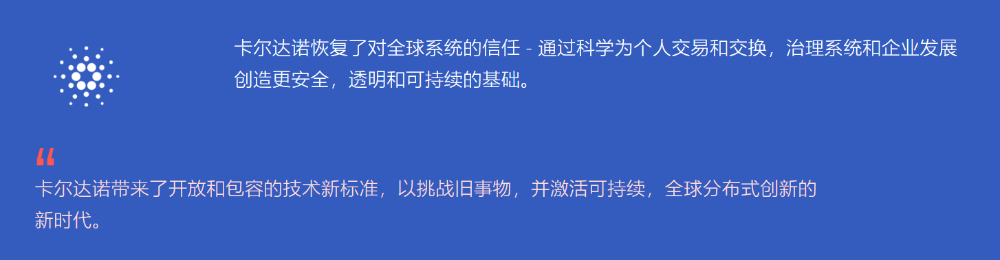

---
weight: 
title: "艾达币-Cardano(ADA)"
description: "加密货币ADA是卡尔达诺（Cardano）协议的所属货币，卡尔达诺可用于发送和接收数字资金"
date: 2022-07-20T21:57:40+08:00
lastmod: 2022-07-20T16:45:40+08:00
draft: false
authors: ["kiki"]
featuredImage: "aidabi-cardanoada.webp"
link: "https://cardano.org/"
tags: ["数字代币","艾达币-Cardano(ADA)"]
categories: ["navigation"]
navigation: ["数字代币"]
lightgallery: true
toc: true
pinned: false
recommend: false
recommend1: false
---
> 卡尔达诺是变革者，创新者和有远见者的区块链平台，拥有为多数人和少数人创造可能性并带来积极的全球变化所需的工具和技术。

##### 1.简介

加密货币ADA是卡尔达诺（Cardano）协议的所属货币，卡尔达诺可用于发送和接收数字资金。这种数字现金代表着货币的未来，并使通过加密技术确保安全的快速直接转账成为可能。

卡尔达诺不仅是一种加密货币，它还是一个技术平台，将能够运行世界各地个人，组织和政府目前每天使用的金融应用程序。

该平台是分层构建的，这使系统具有更易于维护的灵活性，并允许通过软叉进行升级。在将要运行Ada的结算层完成之后，将建立一个单独的计算层来处理智能合约，这些数字法律协议将为未来的商业和业务提供支撑。卡尔达诺还将运行分散式应用程序或dapps服务，这些服务不受任何一方控制，而是在区块链上运行。

这是第一个根据科学原理开发的区块链项目，也是唯一由全球领先的学者和工程师团队设计和建造的项目。该技术必须安全，灵活且可扩展，以供数百万用户使用，这一点至关重要。因此，来自该领域的一些领先专家的大量思想和关怀已投入到该项目中，并做出了明智的设计决策。应用于航空航天和银行业等关键任务系统的科学严谨性已被带入加密货币领域，并具有高度保证的实施性。

我们认为这是第一次完成。

卡尔达诺的一项重大创新在于，它将平衡用户需求与监管机构的需求，并将隐私与监管结合起来。卡尔达诺的愿景是，其新型的标准化计算将通过为所有人提供公平金融服务的开放渠道来带来更大的金融包容性。

##### 2.项目介绍

Cardano是一个开创性的权益证明区块链网络，正在发展为具有多资产分类账和可验证智能合约的去中心化应用（DApp）开发平台。

Cardano采用严格的高可信度形式化开发方法打造，逐步实现实际应用所需的可扩展性，互操作性和可持续性。Cardano有望成为支撑未来经济发展的规模任务关键型DApp的首选平台。Cardano由团队全球专家团队提供支持。Cardano以同行评审的学术研究为基础，体现出开放性和透明性精神。支持Cardano的所有研究和技术规范都是公开发布的，并且所有Cardano开发活动都向公众开放。

设计，从分布式系统到编程语言和博弈理论，这些专家是各个领域的领导者；并由IOHK与合作伙伴共同开发。当网络完全去中心化时，转变属于社区，社区将通过高级治理功能决定其未来。

##### 3.评述

开发人员将Cardano定位为“第三代区块链”。该平台的主要目标是将Litecoin，比特币和以太坊的所有最佳功能实现为一种加密货币；并通过许多其他创新技术来补充由此产生的混合物。与比特币相比，p2p交易比莱特币更快，更便宜，并且智能合约比以太坊更好地实现，从而形成了一个多层次，分散和灵活的系统。

卡尔达诺平台由ADA硬币提供动力。

卡尔达诺的加密货币是以一种称为Haskell的高度安全的编程语言创建的，该语言被认为是最安全的软件语言，从而降低了发生严重错误和DDoS攻击的风险。

卡尔达诺使用了称为Ouroboros的创新的股权证明算法，这是第一种真正为用户提供安全保护的方法，这一点已被科学研究证实。

与许多提供匿名性并牺牲其声誉（洗钱费用）的加密货币不同，卡尔达诺团队与政府和监管机构（特别是在日本）建立了良好的关系，直到最近才谴责了加密货币的想法。
它具有放样机制，借助它可以在ADA的存储中赚钱。
卡尔达诺团队已将ADA代币的最大数量限制在450亿左右。

相关链接：https://info.binance-cn.com/en/currencies/cardanohttps://www.cardano.org/?https://www.cardano.org/zh/academic-papers-3/

----

**我们的世界正在发生变化。团结起来，我们可以让它变得更好。**

卡尔达诺是一个权益证明区块链平台：第一个建立在同行评审研究的基础上，并通过循证方法开发。它结合了开创性的技术，为分散的应用程序，系统和社会提供无与伦比的安全性和可持续性。

卡尔达诺拥有一支领先的工程师团队，其存在是为了将权力从不负责任的结构重新分配到边缘 - 个人 - 并成为积极变革和进步的推动力。

**不可能的历史，成为可能**

## 好处

## 探索卡尔达诺

卡尔达诺是第一个通过同行评审研究构建的区块链平台，足够安全以保护数十亿的数据，可扩展性足以适应全球系统，并且足够强大以支持基础变革。

> ### 人
>
> 通过共同努力，我们为许多人取得了更大的成就。
>
> 卡尔达诺由一个由科学家、工程师和思想领袖组成的分散社区建立，他们团结在一个共同的目标中：创建一个技术平台，点燃世界所需的积极变化。我们认为，未来不应由过去来定义，而且更多的可能性是可能的，而且通过技术，所有人都有可能。我们衡量一项任务的价值不是通过其挑战，而是通过其结果。
>
> 每个ada持有者还持有卡尔达诺网络的股份。存储在钱包中的Ada可以委托给赌注池以获得奖励 - 参与网络的成功运行 - 或承诺到赌注池以增加池获得奖励的可能性。随着时间的推移，ada还将可用于卡尔达诺平台上的各种应用程序和服务。
>
> ### 目的
>
> 为可持续发展的未来而构建的平台，帮助人们更好地合作，相互信任，并为全球问题建立全球解决方案
>
> 卡尔达诺是一个岔路口。它把我们从我们去过的地方带到我们注定要去的地方：一个安全、透明和公平的全球社会，为多数人和少数人服务。就像之前的技术革命一样，它为我们作为个人，企业和社会如何工作，互动和创造提供了一个新的模板。
>
> 卡尔达诺从一个没有中间人的世界开始，在这个世界中，权力不是由少数负责任的人控制的，而是由被赋予权力的许多人控制的。在这个世界上，个人可以控制他们的数据以及他们如何互动和交易。企业有机会独立于垄断和官僚权力结构而发展。社会能够追求真正的民主：自治、公平和负责。这是一个由卡尔达诺创造的世界。
>
> ### 科技
>
> 卡尔达诺带来了一个新的技术标准 - 开放和包容 - 挑战旧事物，并激活一个可持续的全球分布式创新新时代。
>
> 从增量到全球，卡尔达诺改善了我们的互动，交易和创造方式 - 并最终作为全球社会运作。
>
> Cardano是一个基于突破性的Ouroboros权益证明共识协议构建的区块链平台，并使用Haskell编程语言开发：一种函数式编程语言，使Cardano能够追求基于证据的开发，以实现无与伦比的安全性和稳定性。
>
> > 通过循证科学实现的技术
>
> 我们的技术以研究为基础。我们重新定义了通过科学方法创建全球软件平台的含义。我们没有在我们的信仰或方法上妥协。为了建设一个更美好的未来 - 安全，可持续和受许多人管理 - 我们走了一条人迹罕至的道路。我们努力的结果是区块链平台的功能和性能无与伦比，并且真正能够支持全球应用程序，系统和现实生活中的业务用例。
>
> ### 研究
>
> 开创性技术始于突破性研究。
>
> 卡尔达诺从研究开始，并通过研究发展壮大。在我们集成的任何技术开发之前，都要指定它。在指定之前，对其进行了研究。该研究经过同行评审 - 区块链平台的一项独特成就 - 因此我们的想法在得到验证之前可能会受到挑战。
>
> > 为了建立一个持久的未来，我们确保了每个构建块的耐用性和稳定性
>
> 我们的研究 - 由领先的学者领导 - 探索哲学，社会学，行为学和博弈论。为了实现每个结果，我们考虑了可能性的细节：这些变量往往没有得到考虑，但最终可能会影响全球分散平台的完整性和可持续性。我们不认为任何事情是理所当然的。
>
> ### 机会
>
> 每个新机会的中转点。通过卡尔达诺助力您的业务，发现技术的未来
>
> 卡尔达诺为创新新时代提供了模板和工具集。它引入了领先的技术，模型和方法，以帮助个人，开发人员和企业发现新的可能性，实现变革并丰富他们的生活。
>
> 区块链技术为许多遗留挑战提供了答案，无论是财务，社会还是技术。它消除了基本关系的中介，并重新分配了权力，以减轻代价高昂的依赖性，限制性的范式以及低效的交易和交换系统。卡尔达诺是这种潜力的实现者。它是一个具有加速该技术的大规模采用和支持持久生态系统所需的安全性，隐私可持续性和性能标准的平台。
>
> 卡尔达诺提供新的、更安全的、全球可扩展的解决方案。其技术通过循证发展方法不断改进，并以民主投票制度为指导，每个成员都有发言权。卡尔达诺的机会可以适应您的使用案例。这是一个机会，不断创造其他机会。
>
> > 想象得更好。想得更远。创建更改