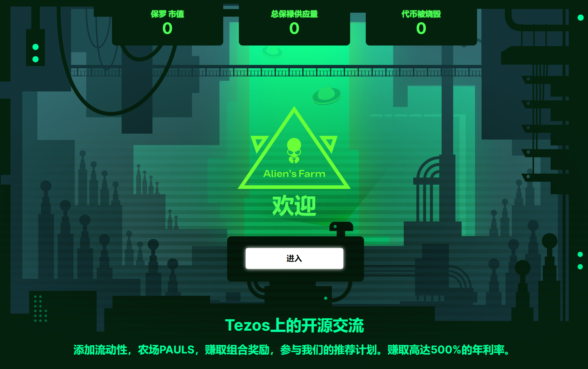

---
title: "Alien'sFarm"
description: "Open-source DEX on Tezos: create your own pools, farm, earn combo rewards. Let's develop the #Tezos #DeFi ecosystem together!"
date: 2022-08-03T00:00:00+08:00
lastmod: 2022-08-03T00:00:00+08:00
draft: false
authors: ["kiki"]
featuredImage: "alien-sfarm.png"
tags: ["DeFi","Alien'sFarm"]
categories: ["nfts"]
nfts: ["DeFi"]
blockchain: "Tezos"
website: "https://aliens.farm/"
twitter: "https://twitter.com/tezaliensfarm"
discord: ""
telegram: ""
github: ""
youtube: ""
twitch: ""
facebook: ""
instagram: ""
reddit: "https://www.reddit.com/r/tezos/comments/rlfy47/aliensfarm/"
medium: ""
steam: ""
gitbook: ""
googleplay: ""
appstore: ""
status: "Live"
weight: 
lightgallery: true
toc: true
pinned: false
recommend: false
recommend1: false
---
它是一个基于 Tezos 的开源平台，具有以下优势：

-  无限制地创建任何代币到代币池。我们的 AMM 支持 FA1.2-FA2 代币。

- 优化路由。 Alien 的 DEX 会自动选择最赚钱的交易路线。

- 作为流动性提供者赚取交易费用。池中每个交易操作的 0.25% 交易费分配给所有流动性提供者。

-  通过在“采矿”部分中为选定的矿池质押 PAUL 来获得组合奖励。这对 PAUL 持有者来说是个好消息；从现在开始，您可以通过在相关池中质押代币来获得组合奖励，并从每个交易操作中赚取 0.05% 的费用。奖励将通过添加到池中的代币收集。数学很简单：池中的交易越密集，您质押的 PAUL 越多，您获得的交易费用就越多。

-  作为开发者赚取 0.05% 的交易费。任何开发人员都可以使用我们的智能合约，并从通过他们的界面进行的每次交易操作中赚取 0.05% 的推荐费。我们希望此功能将通过将我们的产品集成到他们的解决方案中来帮助开发人员赚取更多收入。

-  农场推荐计划。您将从每个关注您的推荐链接的人那里获得农场部分 1% 的质押奖励。

- 具有高回报系数的新 AMM 农场。几天后将推出。

  

## Alien'sFarm相關公鏈

**Tezos**

Tezos（XTZ）是一個多功能平台，支持去中心化應用程序（DApps）和智能合約。它是由前摩根士丹利分析師阿瑟·布雷特曼（Arthur Breitman）在妻子凱瑟琳·布雷特曼（Kathleen Breitman）的支持下開發的，並於2017年推出了首次代幣發行（ICO），籌集了2.32億美元的資金。 ICO一年後，Tezos於2018年7月啟動了beta網絡。

Tezos平台旨在將自校正協議和鏈上治理相結合來管理網絡修改，並支持Turing完整的智能合約。

Tezos基金會還支持Tezos，Tezos基金會是瑞士的一家實體，通過贈款和其他資本手段推廣Tezos協議。

**BSC**

幣安智能鏈（BSC）可以被描述為與幣安鏈並行的區塊鏈。與幣安鏈不同的地方在於，BSC擁有智能合約功能並與以太坊虛擬機（EVM）兼容。這裡的設計目標是保持完整幣安鏈的高吞吐量，同時將智能合約引入其生態系統。

本質上兩個區塊鏈都是並行的。值得注意的是BSC並非所謂的第二層或鏈外擴展性解決方案。它是一個即使幣安鏈下線後也可以運行的獨立區塊鏈。從設計的角度來看，這兩個鏈非常相似。

由於BSC與EVM兼容，因此它支持以太坊工具和DApp。理論上講這使開發人員可以輕鬆地從以太坊移植其項目。對於用戶而言，這表示他們可以輕鬆配置諸如MetaMask之類的應用程序與BSC一起使用，只需調整幾個設置即可。查看使用MetaMask進行幣安智能鏈來開始設置。

**ETH**

什麼是以太坊？

 到 2013 年底，Vitalik Buterin 以白皮書的形式提出了以太坊的想法，他繼續與他的伙伴分享，這個提議也得到了進一步的傳播。由於想法分散，大約有 30 到 40 人聯繫 Vitalik 就該概念進行進一步討論，即使他渴望對他的計劃提出批評，也沒有人提出進一步改進的批評意見。在接下來的 2014 年，這個模型被公開，核心團隊參與了它的實現。除了 Vitalik Buterin，Mihai Alisie、Anthony Di Lorio、Charles Hoskinson、Joe Lubin 和 Gavin Wood 也是核心職能團隊的成員。同一團隊提議進行以太坊的眾籌，這是以太坊的本地代幣，以尋求進一步發展的資金。

基本上，以太坊是一個去中心化的系統，它表明它超出了一個集中的權威或實體的控制範圍。相比之下，絕大多數在線企業、組織和設置都是在集中式權威系統上開發的。儘管同一個系統已經運行了數百年，但與之相關的歷史和過去的事件不斷被證明是錯誤的。儘管如此，在不同派系相互不信任或缺乏相互關係的情況下，使用該系統仍然是必不可少的。

因此，由於 Ethereumm 是去中心化的，它完全自主地工作，這意味著它不受任何權威的固有控制。出於完全相同的原因，以太坊沒有任何中心威脅故障點，因為它由世界各地成千上萬的志願者計算機管理，這使得它即使是片刻也不太可能離線。同樣，用戶的個人數據和憑據會粘貼在他們的設備上，而基於數字媒體（如視頻或應用程序）的內容仍處於其開發人員的授權之下，無需受到主機制定的規則的監控YouTube 或 iOS 等公司。

此外，重要的是要理解，儘管比特幣和以太坊總是被相互比較，但值得一提的是，兩者都與完全不同的存在目的形成對比。比特幣是有史以來第一個加密貨幣，也是一種基於區塊鏈的公共賬本技術開發的匯款。另一方面，以太坊可能從比特幣的後端技術中得到了啟發，但它仍然在很大程度上提高和提高了自己的能力水平。它基於互聯網瀏覽器內的整個網絡、編碼語言和支付機制共同工作，允許用戶在以太坊區塊鏈上開發去中心化應用程序。這樣的應用程序可能是全新的想法，也可能是對現有技術的分散系統的改革形式。這樣就切斷了中間代理人的角色，也消除了與第三方乾預有關的全部費用。

以太坊如何運作？

 由於已經提到以太坊依賴於比特幣的工作能力和功能及其區塊鏈設計，但是，除了貨幣系統的幫助之外，還有許多應用程序的變化。兩個區塊鏈唯一相同的方面是它們在各自網絡上存儲所有交易歷史，但是，以太坊的區塊鏈往往執行的功能遠不止於此。除了交易歷史之外，以太坊網絡上的每個節點還需要下載網絡中每個合約的最新狀態或俗稱的當前狀態，同時還存儲每個用戶的餘額和智能合約代碼。

更重要的是，以太坊區塊鏈被稱為面向事務的狀態機，當您考慮計算機科學時，規定某台機器能夠解釋輸入序列並根據輸入轉換為最新狀態。就在執行交易時，機器會更改為不同的狀態。

每種形式的以太坊都由數百萬筆交易組成，這些交易組合在一起形成區塊，其中每個區塊都與之前的區塊鏈接在一起。然而，在交易與賬本綁定之前，需要進行驗證和確認，它必須經過一個複雜的過程，即挖礦。只是為了更簡單一點，挖掘是一個過程的名稱，在該過程中，一組節點使用其計算技術來完成一項工作挑戰，更準確地說是一項數學任務。根據計算機的功率和能力，它越強大將是更快的數學練習或可以解決的難題。 此外，對這一挑戰的響應或回答本身就是工作證明，並確保某個區塊的授權。

 

居住在世界各地的絕大多數礦工都在為必須形成和授權一個區塊而相互競爭，因為每當新礦工保證一個區塊時，就會形成新的 Ether 代幣並將其發行給該礦工。 礦工是以太坊網絡不可或缺的一部分，因為他們不僅授權和確認交易和其他功能，而且還制定貨幣網絡的新代幣。

**Polygon**

Polygon 是一个去中心化的以太坊扩展平台，使开发人员能够以低交易费用构建可扩展的用户友好 dApp，而无需牺牲安全性。

